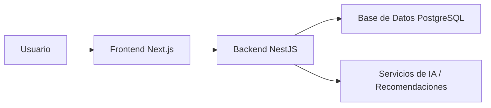

# Arquitectura del Sistema

## Visión general
Orbitfinc se diseñará con una arquitectura modular y escalable, separando responsabilidades para facilitar el crecimiento del producto y la incorporación de nuevas funciones.

## Principios de diseño
- separación clara entre frontend, backend y datos;
- módulos independientes por dominio;
- seguridad por defecto;
- bajo acoplamiento entre servicios y componentes;
- facilidad para agregar nuevas reglas de negocio y recomendaciones.

## Capas propuestas

### 1. Presentación
Responsable de la experiencia de usuario:
- pantallas de autenticación;
- dashboard;
- módulos de ingresos, pagos, calendario y reportes;
- componentes reutilizables y feedback visual.

### 2. Aplicación
Coordina casos de uso y lógica de negocio:
- validación de reglas de negocio;
- orquestación de eventos;
- manejo de permisos y roles;
- servicios de cálculo financiero.

### 3. Dominio
Contiene las reglas clave del negocio:
- hogar;
- ingresos;
- pagos recurrentes;
- conversiones USD/DOP;
- metas y gastos variables;
- cierre mensual.

### 4. Infraestructura
Gestiona acceso a bases de datos, autenticación, almacenamiento y despliegue:
- PostgreSQL;
- Prisma;
- JWT y refresh tokens;
- infraestructura con Docker y servicios en la nube.

## Flujo de datos
1. El usuario interactúa con la interfaz.
2. El frontend envía solicitudes al backend.
3. El backend valida permisos y reglas de negocio.
4. Se persisten los datos en PostgreSQL.
5. El sistema devuelve la respuesta procesada al usuario.

## Diagrama conceptual

## Seguridad propuesta
- HTTPS en producción.
- autenticación con JWT + refresh tokens;
- encriptación de contraseñas con Argon2;
- validación estricta con Zod;
- control de permisos por rol;
- auditoría de movimientos importantes.
